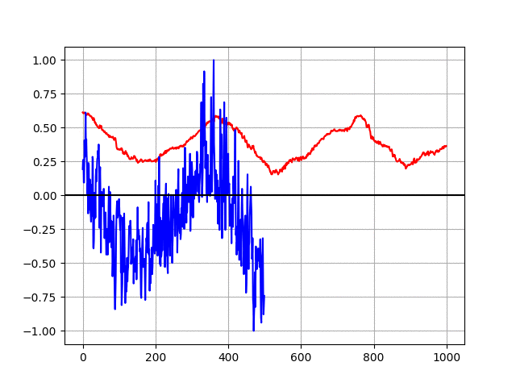
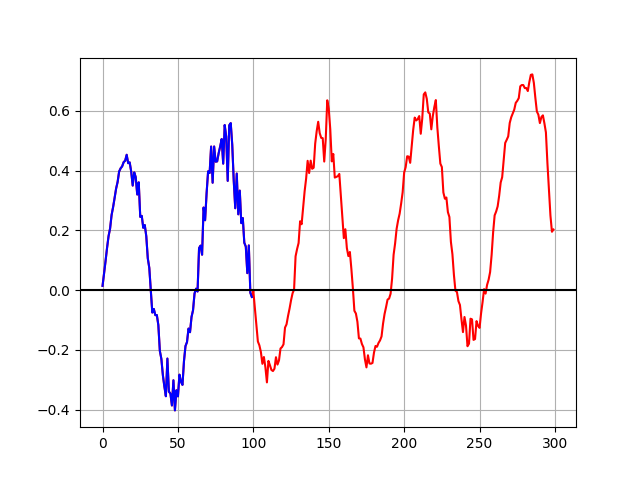

# Transformer Time Series Prediction

This repository contains two Pytorch models for transformer-based time series prediction. Note that this is just a proof of concept and most likely not bug free nor particularly efficient.

* transformer-singlestep.py contains a single-step prediction model
* transformer-multistep.py contains a multi-step prediction model

This is the output of a single step prediction model that has been trained for 100 epochs on the [daily minimum temperature dataset](./daily-min-temperatures.csv).

The model is also capable of multi-step predictions. In this case, the model predicted 200 steps based on 100 steps input. It was able to learn long term trend from the training data:

(input blue, prediction red)